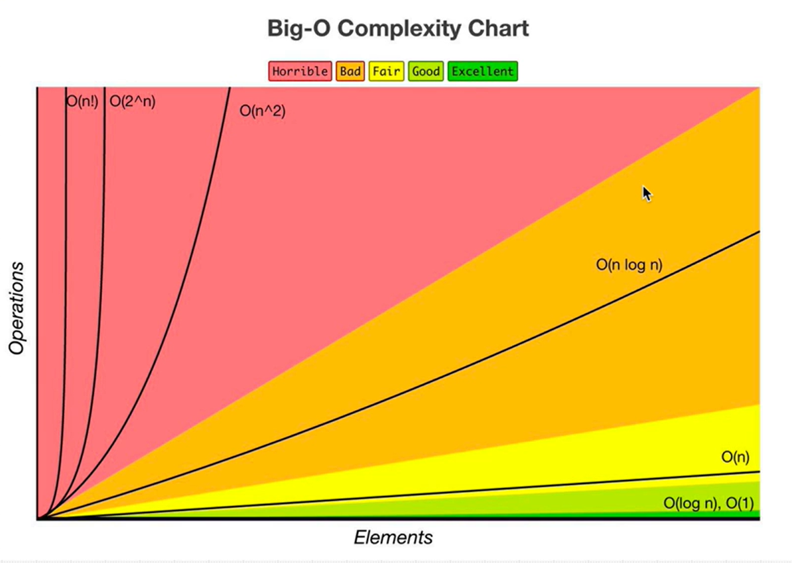
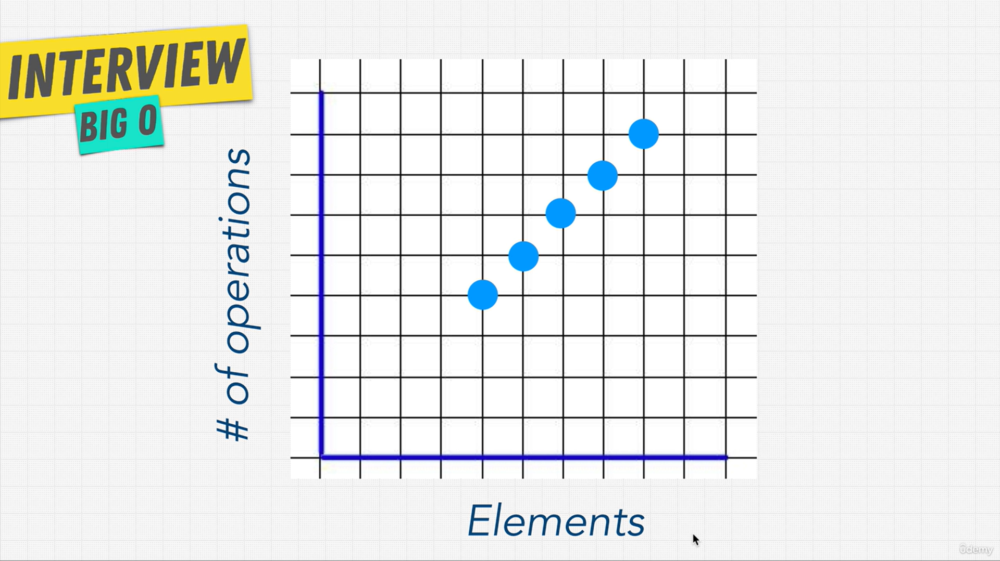
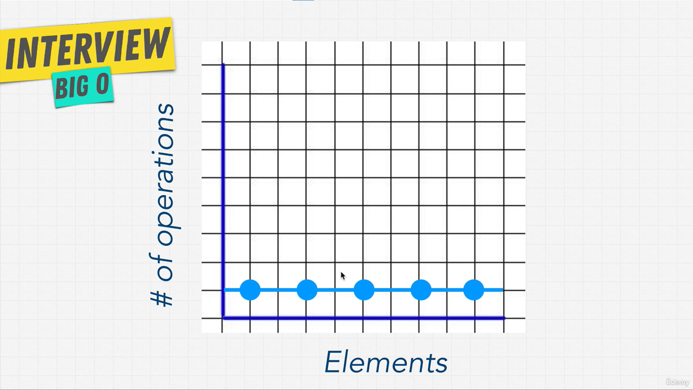
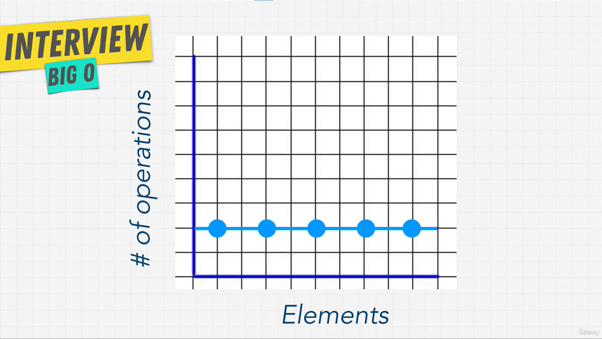

# Big O Notation

## What Is Good Code?

Good code has two qualities:

1. **Readable**: clean code that other people can understand.
2. **Scalable**: code that keeps performing well as the input grows. **Big O** is how we measure this.

There are many ways to solve the same problem, and some are more efficient than others.

**Runtime** is how long a function takes to run. Big O measures how that runtime grows as the input gets larger.

```js
const nemo = ["nemo"];

function findNemo(array) {
  for (let i = 0; i < array.length; i++) {
    if (array[i] === "nemo") {
      console.log("Found NEMO!");
    }
  }
}

findNemo(nemo); // Found NEMO!
```

> Key question: what happens to this function's runtime as the array gets bigger and bigger?

## Big O and Scalability

- **Timing code is unreliable.** The result depends on CPU, other running programs, language, etc. The same code gives different times on different machines.
- **Big O** measures how much an algorithm slows down as the input grows, independent of hardware.
- Big O counts **operations (steps)**, not seconds. Each operation takes time.
- Slower growth = better scalability (the fewer extra operations needed as the input gets bigger, the better the code scales). This is called **algorithmic efficiency**.

```js
const large = new Array(100000).fill("nemo");

function findNemo(array) {
  let t0 = performance.now();
  for (let i = 0; i < array.length; i++) {
    if (array[i] === "nemo") console.log("Found NEMO!");
  }
  let t1 = performance.now();
  console.log(`Time taken: ${t1 - t0} ms`);
}

findNemo(large); // Time taken: ~3312 ms (varies by machine)
```

| Input size | Time (approx.) |
| ---------- | -------------- |
| 1          | ~0 ms          |
| 100        | ~2.5 ms        |
| 1,000      | ~7 ms          |
| 10,000     | ~46 ms         |
| 100,000    | ~3300 ms       |

More input → more operations → more time.



| Rating    | Complexity          |
| --------- | ------------------- |
| Excellent | O(1), O(log n)      |
| Fair      | O(n)                |
| Bad       | O(n log n)          |
| Horrible  | O(n²), O(2ⁿ), O(n!) |

## O(n)

- **O(n)** is called **linear time**.
- The number of steps grows **at the same rate** as the input size.
- **n** = the number of inputs (items). It is just a letter we use by habit; any letter works.
- O(n) is the **most common** Big O.

```js
function findNemo(array) {
  for (let i = 0; i < array.length; i++) {
    if (array[i] === "nemo") {
      console.log("Found NEMO!");
    }
  }
}
```

The loop checks every item once, so:

| Items in array (n) | Steps   |
| ------------------ | ------- |
| 1                  | 1       |
| 4                  | 4       |
| 10                 | 10      |
| 100,000            | 100,000 |



Each new item adds one more step. The dots make a **straight line**, so it is called _linear_.

> **Takeaway:** If the code goes through every item one time, it is **O(n)**: double the items, double the steps.

## O(1)

- **O(1)** is called **constant time**.
- The number of steps **stays the same**, no matter how big the input is.
- On the graph it is a **flat line**.
- Rated **excellent**: it always takes the same amount of work, so you know what to expect.

Example: a shop has a line (queue) of customers. Serve the **first** customer.

```js
const customers = ["Alice", "Bob", "Charlie", "David"];

function getFirstCustomer(customers) {
  return customers[0]; // go straight to position 0
}

getFirstCustomer(customers); // "Alice"
```

It goes **straight** to the first item. It never looks at the others, so:

| Customers in line (n) | Steps |
| --------------------- | ----- |
| 1                     | 1     |
| 10                    | 1     |
| 100,000               | 1     |

**What about 2 steps?**

Example: a game shows the **top 2 players** from a leaderboard that is already sorted.

```js
const leaderboard = ["Sara", "John", "Mia", "Tom"];

function showTopTwo(leaderboard) {
  console.log("1st:", leaderboard[0]); // O(1)
  console.log("2nd:", leaderboard[1]); // O(1)
}
```

- This is 2 steps every time, so **O(2)**. The line is still flat.
- O(2), O(3), even O(100) are all written as **O(1)**. We only care that the number of steps never grows.

 

*Left: O(1), always 1 step. Right: O(2), always 2 steps. Both are flat lines, so both are O(1).*

> **Takeaway:** If the steps do not change when the input grows, it is **O(1)**.

## Exercise: Big O Calculation

Count every step and ask: **how many times does this line run?**

- Runs **once** → **O(1)**
- Runs **once for each item** (inside the loop) → **O(n)**

```js
function funChallenge(input) {
  let a = 10;    // O(1)
  a = 50 + 3;    // O(1)

  for (let i = 0; i < input.length; i++) { // O(n)
    anotherFunction();   // O(n)
    let stranger = true; // O(n)
    a++;                 // O(n)
  }
  return a;      // O(1)
}
```

| Part                         | Count         |
| ---------------------------- | ------------- |
| 3 lines outside the loop     | 3 × O(1)      |
| The loop + 3 lines inside it | 4 × O(n)      |
| **Total**                    | **O(3 + 4n)** |

Example: if `input` has 5 items → 3 + (4 × 5) = **23 steps**.

- You do **not** need to count this exactly in an interview. People don't agree on whether lines like `let a = 10` should count.
- Later, the rules will make this simpler: **O(3 + 4n) → O(n)**.

> **Takeaway:** Lines outside a loop run once (O(1)). Lines inside a loop run n times (O(n)).

## Exercise: Big O Calculation 2

```js
function anotherFunChallenge(input) {
  let a = 5;   // O(1)
  let b = 10;  // O(1)
  let c = 50;  // O(1)

  for (let i = 0; i < input; i++) { // O(n)
    let x = i + 1; // O(n)
    let y = i + 2; // O(n)
    let z = i + 3; // O(n)
  }

  for (let j = 0; j < input; j++) { // O(n)
    let p = j * 2; // O(n)
    let q = j * 2; // O(n)
  }

  let whoAmI = "I don't know"; // O(1)
}
```

| Part                               | Count         |
| ---------------------------------- | ------------- |
| 4 lines outside the loops          | 4 × O(1)      |
| 2 loop lines + 5 lines inside them | 7 × O(n)      |
| **Total**                          | **O(4 + 7n)** |

Example: if `input` is 5 → 4 + (7 × 5) = **39 steps**.

- **4 + 5n or 4 + 7n?** The instructor wrote **O(4 + 5n)** because he did not count the 2 `for` lines. In Exercise 1 he **did** count the `for` line. If you count the same way both times, the answer is **O(4 + 7n)**.
- It does not matter much. Both become **O(n)** after simplifying.

> **Takeaway:** Two loops one after the other (not one inside the other) still grow in a straight line → **O(n)**.

## Simplifying Big O

- In interviews you **never** count every step like O(3 + 4n).
- You look at the function and give a **short answer**, like **O(1)**, **O(log n)**, **O(n)** or **O(n log n)** (only say how the steps grow, without the extra numbers. So you say **O(n)**, not O(3 + 4n)).
- There are **4 rules** that make this quick. See [02-Big-O-Rules.md](02-Big-O-Rules.md).

| Exercise   | Full count | Short answer |
| ---------- | ---------- | ------------ |
| Exercise 1 | O(3 + 4n)  | **O(n)**     |
| Exercise 2 | O(4 + 7n)  | **O(n)**     |

**The 4 rules**

1. **Worst case:** always think about the slowest possible run.
2. **Remove constants:** drop plain numbers. O(3 + 4n) → O(n).
3. **Different terms for inputs:** two different inputs get two different letters, like O(a + b).
4. **Drop non-dominants:** keep only the biggest part. O(n² + n) → O(n²).

> **Takeaway:** Learn the 4 rules and you can find the Big O without counting.
