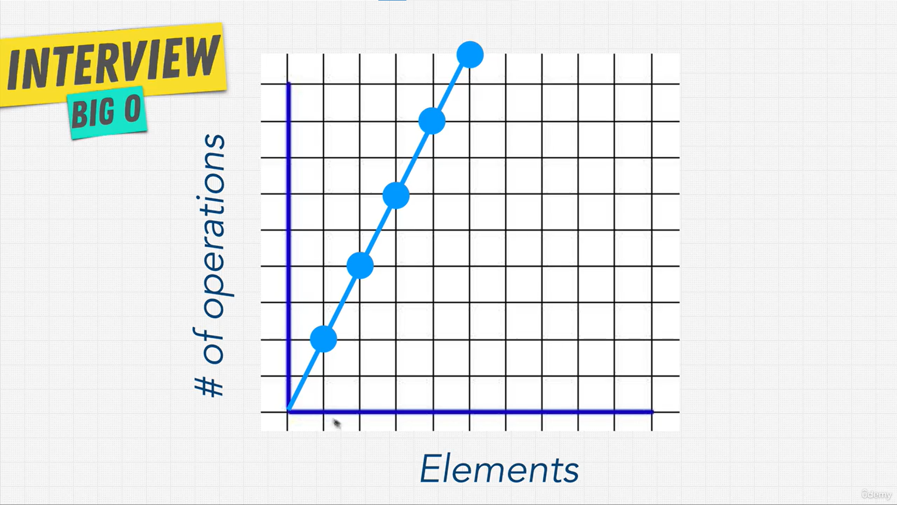
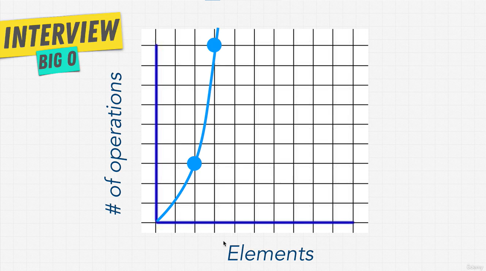

# Big O Rules

## Rule 1: Worst Case

- Big O always looks at the **worst case** (the slowest possible run).
- We can't know what the input will be, so we plan for the slowest case.

```js
const everyone = ["dory", "bruce", "marlin", "nemo", "gill", "bloat", "nigel", "squirt", "darla", "hank"];

function findNemo(array) {
  for (let i = 0; i < array.length; i++) {
    if (array[i] === "nemo") {
      console.log("Found NEMO!");
      break; // stop the loop once Nemo is found
    }
  }
}
```

- Without `break`, the loop always checks **all 10** items, even after it finds Nemo.
- With `break`, it stops early. Here Nemo is 4th, so it takes only **4** steps.
- `break` makes the code faster, and that is good practice. But the **Big O does not change**.

| Where Nemo is         | Steps (10 items) | Case           |
| --------------------- | ---------------- | -------------- |
| 1st item              | 1                | Best case      |
| 4th item              | 4                | -              |
| Last item (or absent) | 10               | **Worst case** |

The worst case still checks every item, so it is **O(n)**.

> **Takeaway:** Always give the Big O for the worst case. `findNemo` is **O(n)**, even with `break`.

## Rule 2: Remove Constants

- **Constants** are plain numbers in the Big O, like the 100 in O(n + 100) or the 2 in O(2n).
- **Drop them.** When n is very big (like 1,000,000), adding 100 steps or halving the steps doesn't change the picture.
- Big O only cares about the **shape of the line** (flat, straight, curved), not how steep it is.

**Example 1**

```js
function printFirstItemThenFirstHalfThenSayHi100Times(items) {
  console.log(items[0]);                            // O(1)

  var middleIndex = Math.floor(items.length / 2);
  var index = 0;
  while (index < middleIndex) {                     // O(n/2): half of the items
    console.log(items[index]);
    index++;
  }

  for (var i = 0; i < 100; i++) {                   // O(100): always 100, whatever the input
    console.log("hi");
  }
}
```

**O(1 + n/2 + 100)** → drop the numbers → **O(n)**

**Example 2: two loops, one after the other**

A shop sends every customer an email, then a text message.

```js
function notifyCustomers(customers) {
  customers.forEach((c) => sendEmail(c)); // O(n)
  customers.forEach((c) => sendSMS(c));   // O(n)
}
```

**O(n + n) = O(2n)** → drop the 2 → **O(n)**

| Customers (n) | Steps (2n) |
| ------------- | ---------- |
| 1             | 2          |
| 2             | 4          |
| 3             | 6          |
| 1,000         | 2,000      |



The line is **steeper** than O(n), but it is still a **straight line**, so it is still **O(n)**.

- You will almost never see plain numbers in a Big O answer.
- Numbers only appear as part of the name, like **O(1)**, **O(n²)** or **O(2ⁿ)**.

> **Takeaway:** Drop the numbers. O(2n), O(n/2) and O(n + 100) are all **O(n)**.

## Rule 3: Different Terms for Inputs

- If a function has **two different inputs**, give each one **its own letter**.
- Two different lists can have different sizes. One could have 100 items, the other just 1.
- This is a **common interview mistake**. Two loops don't always mean O(2n) → O(n).

**Same input, two loops → O(n)**

```js
function notifyCustomers(customers) {
  customers.forEach((c) => sendEmail(c)); // O(n)
  customers.forEach((c) => sendSMS(c));   // O(n)
}
```

Both loops go over the **same** list: O(2n) → **O(n)**.

**Different inputs, two loops → O(a + b)**

A shop emails all its customers, then sends a text message to all its staff.

```js
function notifyEveryone(customers, staff) {
  customers.forEach((c) => sendEmail(c)); // O(a): a = number of customers
  staff.forEach((s) => sendSMS(s));       // O(b): b = number of staff
}
```

The two loops go over **different** lists, so it is **O(a + b)**, not O(n).

| Customers (a) | Staff (b) | Steps (a + b) |
| ------------- | --------- | ------------- |
| 100           | 1         | 101           |
| 5             | 500       | 505           |
| 1,000         | 1,000     | 2,000         |

- The letters don't matter. O(a + b), O(n + m) and O(customers + staff) mean the same thing.

> **Takeaway:** Same input → one letter. Different inputs → different letters: **O(a + b)**.

## O(n^2)

- **O(n²)** is called **quadratic time**.
- It happens when there is a **loop inside a loop** (nested loops) over the same input.
- Rated **horrible**: the steps grow very fast as the input grows.
- Common interview task: start with an O(n²) solution, then make it faster.

**Example: log all pairs**

```js
const letters = ["a", "b", "c", "d", "e"];

function logAllPairs(array) {
  for (let i = 0; i < array.length; i++) {     // O(n)
    for (let j = 0; j < array.length; j++) {   // O(n) for each i
      console.log(array[i], array[j]);
    }
  }
}

logAllPairs(letters); // a a, a b, a c ... e d, e e
```

For each item, the inner loop goes through **all** items again: O(n × n) = **O(n²)**.

| Items (n) | Steps (n²) |
| --------- | ---------- |
| 2         | 4          |
| 3         | 9          |
| 10        | 100        |
| 1,000     | 1,000,000  |



The line **bends upward**. Each new item adds more steps than the last one.

**Add or multiply?**

| How the loops are placed       | What to do   | Same input       | Different inputs |
| ------------------------------ | ------------ | ---------------- | ---------------- |
| One after another (same level) | **Add**      | O(n + n) → O(n)  | O(a + b)         |
| One inside the other (nested)  | **Multiply** | O(n × n) = O(n²) | O(a × b)         |

Example with different inputs: for every customer, show every product.

```js
function showProducts(customers, products) {
  customers.forEach((c) => {         // a = number of customers
    products.forEach((p) => {        // b = number of products
      console.log(c, p);
    });
  });
}
```

Nested loops over **different** inputs: **O(a × b)**, not O(n²).

> **Takeaway:** Loops one after another → **add**. Loops inside loops → **multiply**. Nested loops over the same input = **O(n²)**.

## Rule 4: Drop Non-Dominants

- **Keep only the biggest part** of the Big O. Drop the smaller parts.
- When the input gets big, the biggest part does almost all the work. The small parts stop mattering.

**Example**

```js
function printAllNumbersThenAllPairSums(numbers) {
  numbers.forEach((n) => console.log(n));           // O(n)

  numbers.forEach((a) => {                          // O(n²): loop inside a loop
    numbers.forEach((b) => console.log(a + b));
  });
}

printAllNumbersThenAllPairSums([1, 2, 3, 4, 5]);
// 1 2 3 4 5, then 2 3 4 5 6, 3 4 5 6 7 ...
```

**O(n + n²)** → keep the biggest part → **O(n²)**

**Why the biggest part wins:** take O(x² + 3x + 1000 + x/2)

| Part   | x = 5 | x = 500     |
| ------ | ----- | ----------- |
| x²     | 25    | **250,000** |
| 3x     | 15    | 1,500       |
| 1000   | 1,000 | 1,000       |
| x/2    | 2.5   | 250         |

- When x is small, 1000 is the biggest part.
- When x is big, **x²** is far bigger than everything else. Big O cares about big inputs, so the answer is **O(x²)**.

**This explains the earlier answers**

| Full count   | Simplified |
| ------------ | ---------- |
| O(3 + 4n)    | O(n)       |
| O(4 + 7n)    | O(n)       |
| O(n + n²)    | O(n²)      |

**More loops inside loops**

- 3 loops inside each other → **O(n³)**. 4 → O(n⁴), and so on.
- 3 nested loops is almost always a **bad idea**. It gets slow very fast and usually means there is a better way.

> **Takeaway:** Keep only the part that grows the fastest. O(n + n²) → **O(n²)**.

## O(n!)

- **O(n!)** is called **factorial time**.
- It is the **slowest** Big O of all, with the steepest line on the chart.
- It is like **adding one more loop inside a loop for every item**.
- You will almost **never** see it. If your code is O(n!), something is wrong.

**What does `!` mean?** Multiply the number by every whole number below it, down to 1.

- 3! = 3 × 2 × 1 = **6**
- 5! = 5 × 4 × 3 × 2 × 1 = **120**

Example: all the ways to put n people in a line. With 3 people (A, B, C) there are 6 ways: ABC, ACB, BAC, BCA, CAB, CBA.

| Items (n) | O(n²) steps | O(n!) steps   |
| --------- | ----------- | ------------- |
| 3         | 9           | 6             |
| 5         | 25          | 120           |
| 10        | 100         | **3,628,800** |

> **Takeaway:** O(n!) is the worst Big O. Know that it exists, but avoid it.

## Big O Cheat Sheet

See the full cheat sheet: [Cheat-Sheet.md](Cheat-Sheet.md)

## What Does This All Mean?

- **Big O matters most for big inputs.** With small inputs (like 5 items), all the lines on the chart are close together, so the choice barely matters.
- **Inputs grow.** A site with 100 users today may have 1,000,000 later. Write code that still works well when that happens, so you don't have to keep fixing it.
- **Built-in methods have a Big O cost too.** Examples with JavaScript arrays:

| Array task                          | Big O    |
| ----------------------------------- | -------- |
| Get an item by position (`arr[0]`)  | **O(1)** |
| Search for an item                  | **O(n)** |
| Add to the start (`unshift`)        | **O(n)** |

(The data structures section explains why.)

- **Data structures** = ways to store data (array, object, ...).
- **Algorithms** = ways to use that data (functions).
- Each data structure is fast at some tasks and slow at others. Big O helps you **pick the right one**.
- Most interviews test this: *which data structure and algorithm is the best fit?*
- Reference: [bigocheatsheet.com](https://www.bigocheatsheet.com/) shows the Big O of common data structures and sorting methods.

> **Takeaway:** Big O helps you write code that **scales**, and helps you choose the right data structure and algorithm.
