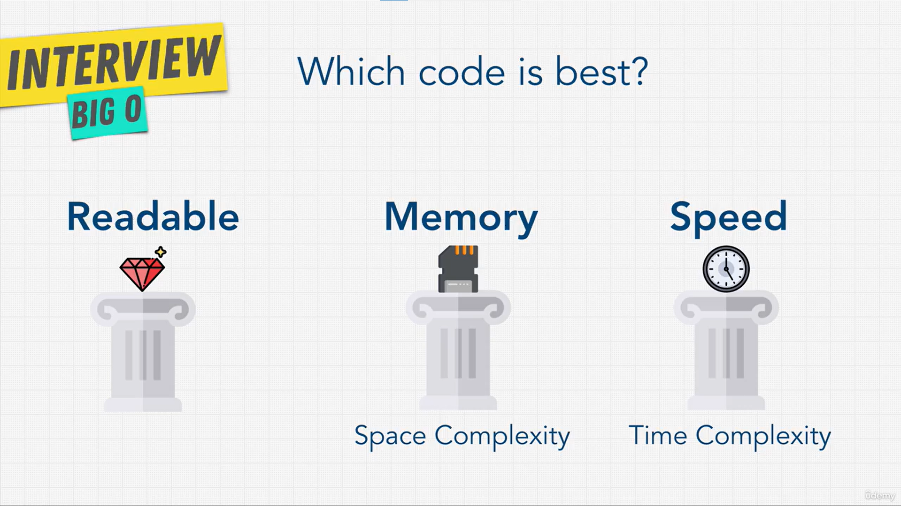

# Space Complexity

## 3 Pillars of Programming

So far, "scalable" meant only **speed**. But a computer has two limited things:

- **Speed (time)**: how fast the code runs. This depends on the **CPU**.
- **Memory (space)**: how much memory the code uses. This depends on the **RAM**.

Memory is much cheaper and bigger today than in the past, but it is still **not unlimited**.

**Which code is best?** Good code does well in these three things:



| Pillar       | Question                                    | Name             |
| ------------ | ------------------------------------------- | ---------------- |
| **Readable** | Can other people read and change it easily? | -                |
| **Speed**    | How many steps does it take to run?         | Time Complexity  |
| **Memory**   | How much memory does it use?                | Space Complexity |

- We use **Big O** for both speed and memory. Same way of writing (`O(1)`, `O(n)` ...), but it measures a different thing.
- Learning memory (space) is easier than learning speed (time).

> **Trade-off:** You often can't have both. Faster code usually needs **more memory**. Code that uses **less memory** is often **slower**. You must choose what matters more.

## Space Complexity

When a program runs, it has **two places to remember things**:

| Place     | What it keeps                                        |
| --------- | ---------------------------------------------------- |
| **Heap**  | Variables and the values we give them                |
| **Stack** | Function calls (which function is running right now) |

Sometimes we care more about **using less memory** than about running faster.

**Space complexity** works just like time complexity. We ask: **when the input gets bigger, how much new memory does the code use?** We count the new variables and new things the code creates.

- Think of memory as a **box with a size limit**. If the code creates too many things, the box gets too full and **overflows**.
- One example is a **Stack Overflow**: too many function calls fill up the stack. We will learn this later in **recursion** (when a function calls itself again and again).

### What causes space complexity?

- **Variables**
- **Data structures** (arrays, objects, hash tables)
- **Function calls**
- **Allocations** (creating new things in memory)

## Exercise: Space Complexity

> **Important:** Space complexity counts only the **new (extra) memory** the function uses. We **do not count the input**, because the function can't control what input it gets. It can only control what it creates inside.

### Example 1: `O(1)` space

```js
function boooo(n) {
  for (let i = 0; i < n.length; i++) {
    console.log("boooo!");
  }
}

boooo([1, 2, 3, 4, 5]); // O(1)
```

- **Time:** `O(n)`. The loop runs once for every item.
- **Space:** `O(1)`. The only new thing is one variable, `let i = 0`. It is the same one variable whether the input has 5 items or 5,000.

### Example 2: `O(n)` space

```js
function arrayOfHiNTimes(n) {
  let hiArray = [];
  for (let i = 0; i < n; i++) {
    hiArray[i] = "hi";
  }
  return hiArray;
}

arrayOfHiNTimes(6); // O(n)
```

- The function creates a **new array** and puts `n` items in it.
- `n = 6` → 6 new items. `n = 1,000` → 1,000 new items. More input = more memory.
- `let i = 0` is just 1 variable, so we remove it (Rule 2: remove constants).
- **Space:** `O(n)`.

> **In short:** If the function only makes a few simple variables, space is `O(1)`. If it makes something that grows with the input (like a new array filled in a loop), space is `O(n)`. Remember the trade-off: sometimes you save time by using more memory, or save memory by using more time.

## Exercise: Twitter

Imagine you work at Twitter. Your boss asks for a button that shows a user's **first (oldest) tweet** and **last (newest) tweet**.

### Task 1: Find the first and last tweet → `O(1)`

If the tweets are kept in an array (oldest first, newest last):

```js
// Find 1st, Find Nth...
const array = ["hi", "my", "teddy"];
array[0]; // O(1) → 'hi' (oldest)
array[array.length - 1]; // O(1) → 'teddy' (newest)
```

- With an array, you can jump straight to any position by its number (`0`, `1`, `2` ...). No loop is needed, so each one is **1 step**.
- `array.length - 1` = `3 - 1` = `2`, which is the last position.
- 2 steps in total = `O(2)`. Remove the number (Rule 2) → **`O(1)`**.

### Task 2: Compare the dates of all tweets → `O(n^2)`

Now your boss wants you to compare the date of **every tweet with every other tweet**.

```js
const array = [
  { tweet: "hi", date: 2012 },
  { tweet: "my", date: 2014 },
  { tweet: "teddy", date: 2018 },
];
// O(n^2)
```

- Comparing every item with every other item needs a **loop inside a loop**, so it is **`O(n^2)`**.
- 3 tweets is fine. But a user with 10,000 tweets → 100,000,000 steps. This can be **slow and cost the company a lot of money**.
- A good engineer sees this early and tells the boss: "This will be slow. Maybe we should store the data in a better way."

### Bonus question: what is the Big O of `.length`?

```js
"hellooooooooooooo".length; // ?
```

- **Answer: it depends on the programming language.**
- In some languages, `.length` counts the letters one by one → `O(n)`.
- In **JavaScript**, every string already keeps its length saved. `.length` just reads that saved number, so it is **`O(1)`**.
- This is a common interview question. You need to know **how your language works inside** to give the right answer.

> **Key idea:** Time and memory are both limited. Thinking about them before you write code makes you a better engineer.

## JavaScript Loops

There are many ways to write a loop in JavaScript (and in other languages too). You will see these in this course, so it's good to know them. **They all do the same job.**

### 1. `for` loop

```js
function findNemo(array) {
  for (let i = 0; i < array.length; i++) {
    if (array[i] === "nemo") {
      console.log("Found NEMO!");
    }
  }
}
```

- `i` is the **position** (0, 1, 2 ...). You get the item with `array[i]`.

### 2. `forEach`

```js
const findNemo2 = (array) => {
  array.forEach((fish) => {
    if (fish === "nemo") {
      console.log("Found NEMO!");
    }
  });
};
```

- Shorter to write. You don't need `i`, `array.length` or `i++`.
- `fish` is the **item itself**, not its position.

### 3. `for...of` loop

```js
const findNemo3 = (array) => {
  for (let fish of array) {
    if (fish === "nemo") {
      console.log("Found NEMO!");
    }
  }
};
```

- Also gives you the **item itself** (`fish`) one by one.

| Loop       | What you get       | Big O (time) |
| ---------- | ------------------ | ------------ |
| `for`      | Position (`i`)     | `O(n)`       |
| `forEach`  | Item (`fish`)      | `O(n)`       |
| `for...of` | Item (`fish`)      | `O(n)`       |

> **Key idea:** All three are just loops, so all are `O(n)`. The only difference is **how easy they are to read**. Remember: good code is both **fast** and **readable**.

## Section Summary

### Why Big O matters

- Good code is **readable** and **scalable**. Big O measures how scalable it is.
- Time and memory **cost money**. If your code saves a company time and money, you are very valuable.
- You won't use Big O every day at work, but you should **always keep it in mind**. That's why it is so common in **interviews**.

### What we learned

| Thing               | Meaning                                  |
| ------------------- | ---------------------------------------- |
| **Time complexity** | How long the code takes to run           |
| **Space complexity**| How much memory the code needs           |

- We use **Big O** for both.
- They are a **trade-off**: making one better often makes the other worse.
- Big O always looks at the **worst case** (the slowest / most memory). We plan for the worst, so we are ready for it.

### Big O is not everything

- `O(n)` is **not always better** than `O(n^2)`. Readability matters too.
- Sometimes **readable code** matters more than fast code. Sometimes **memory** matters more than speed.
- **"Premature optimization is the root of all evil."** This is a famous saying. It means: don't try to make code super fast too early. It can make the code **hard to read**.
- Example: a small new company (startup) with little money needs to **build things fast**. Simple, easy code may be better for them than super-fast code.
- A great engineer finds the **right balance** between speed, memory and readability.

### Big O is only for big data

- Big O is about what happens when the data gets **very big**.
- If your input is always small (for example, always 7 items), an `O(n)` solution can be just as good, or even better, than an `O(1)` one.
- **It depends on your situation.**

> **Key idea:** Now you have a new way to look at code. When someone asks "How good is my code?", you can measure it: **Is it readable? How fast is it? How much memory does it use?** We will keep using Big O in the rest of this course.
