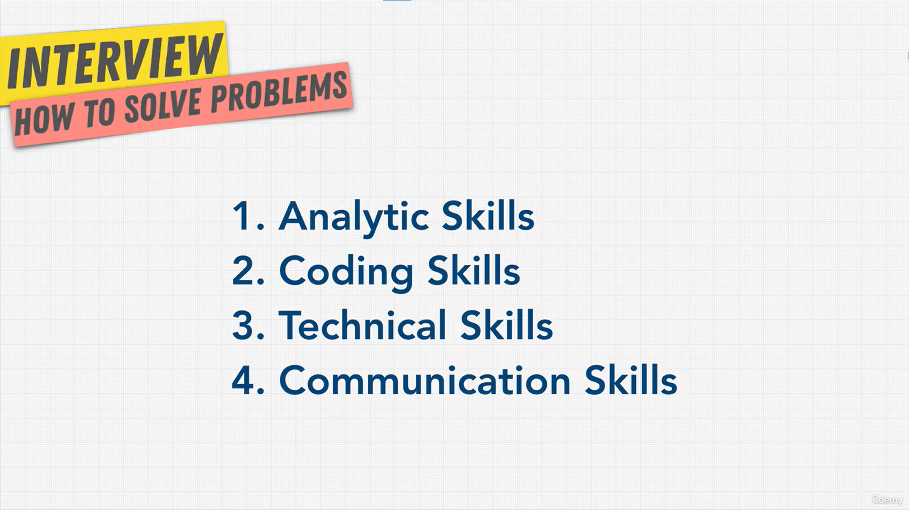
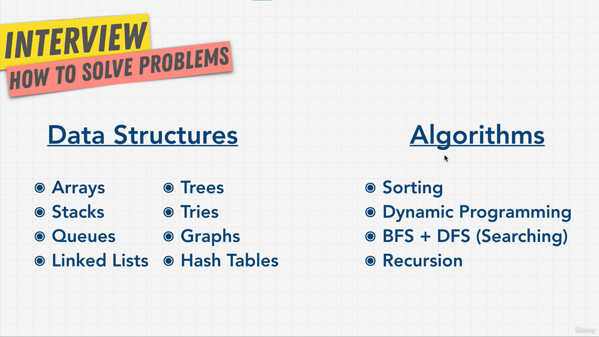

# What Companies Want

## Section Overview

- Main question of an interview: **Can you solve the company's problems?**
- Knowing all data structures and algorithms is **not enough** to pass.

**You fail if you:**

- Can't talk to people well
- Don't work well with others
- Write messy code
- Can't explain your solution

**What they check:**

| Not this                      | But this                                                     |
| ----------------------------- | ------------------------------------------------------------ |
| Just getting the right answer | **How you think** to reach the answer                        |
| Memorizing things             | **Really understanding** them                                |
| Knowing one "best" solution   | Knowing the **trade-offs** (data structures, time vs memory) |

**This section covers:**

1. How to do well in technical interviews
2. A Google interview example, step by step
3. A cheat sheet to read before interviews
4. Solving a problem and comparing solutions with Big O

> **Key idea:** Not a memory test. Show how you think and know the trade-offs.

## What Are Companies Looking For?

Companies check **4 skills**, not just coding:

| Skill                | Meaning                                   |
| -------------------- | ----------------------------------------- |
| **1. Analytic**      | How you think to solve a problem          |
| **2. Coding**        | Your code is clean and easy to read       |
| **3. Technical**     | You know the basics and the pros and cons |
| **4. Communication** | You talk well and work well with a team   |

**You don't need to:**

- Memorize every algorithm
- Solve 1,000 practice problems
- Know every answer. Everyone uses Google.

**You need to:**

- Know which data structures and algorithms exist
- Know **when** and **why** to use each one
- Solve problems on your own

**How to study:**

- Do all the exercises
- Always ask **why**

> **Key idea:** Know **when and why** to use each tool, not just how.

## What We Need For Coding Interviews

**Why only these?**

- There are many more, but these are the ones used most of the time.
- These are what interviews ask about.
- Like learning a language: learn the common words, not the whole dictionary.

**For each one, learn:**

- **When** and **why** to use it
- **How** to build it
- **How** to solve problems with it
- Its **Big O** (speed and memory)

**Why interviews ask this:**

- Most people don't prepare. If you work hard, you stand out.
- It's not as hard as it looks. Just spend time on the right things.

> **Key idea:** A coding interview = the right data structures + algorithms + code that is readable, fast and uses little memory (Big O).
