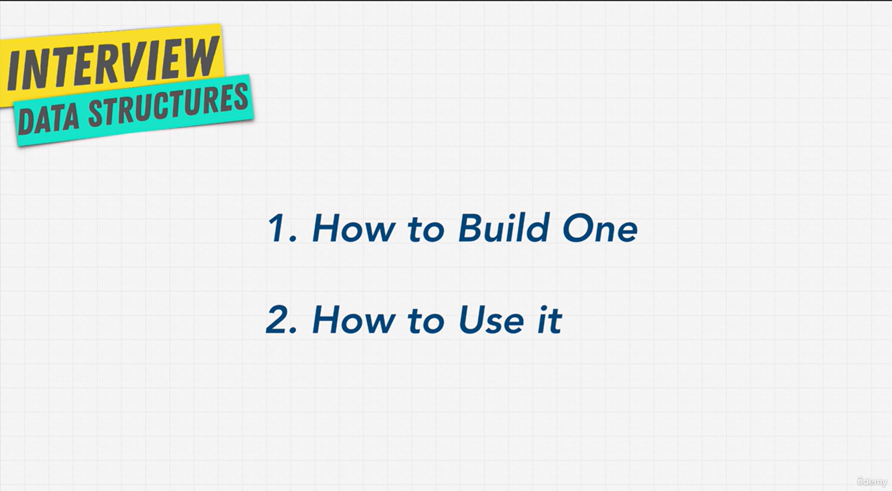

# What Is A Data Structure

## Section Overview

- **Data structure** = a collection of values.
- **Algorithm** = the steps to work with those values.
- Data structures + algorithms = programs.

**Why learn them:**

- They never go out of date. Languages and libraries change, these don't.
- Every kind of coding uses them (React, Angular, games...).
- Know them well → you can solve any problem and pick the right tool.
- That's why big companies (Google, Amazon, Netflix...) ask about them.

> **Key idea:** Data structures and algorithms are the basics under all code. Learn them once, use them in any language.

## What Is A Data Structure?

A **data structure** is a collection of values. The values can be **linked** to each other, and we can use **functions** on them. Each data structure is **good at its own job**.

### Think of containers at home

Look around your home. You have lots of containers, and each one is made for one kind of thing:

| Container | Holds   |
| --------- | ------- |
| Backpack  | Books   |
| Drawer    | Clothes |
| Fridge    | Food    |
| Folder    | Papers  |
| Box       | Toys    |

You don't put yogurt in a drawer, because it will go bad. You don't put your papers in a toy box, because they will get crumpled. You pick the **right container** so you can **put things in** and **take them out** easily.

Data structures are the same. They are containers for data. Each one makes it easy to store and find a certain kind of data.

### There are many, but only a few matter

There are lots of data structures, just like there are lots of containers in real life. But you only need about **5–6 important ones**.

You've already used some: in JavaScript, **arrays** and **objects** are data structures. Even **blockchain** (the tech behind Bitcoin) is just a data structure, a way to hold information.

### Every data structure has trade-offs

Remember the 3 pillars: **readable, memory, speed**? Data structures are the same. One is better at some things, another is better at other things. That's why there are so many: each one fits its own case.

### 2 parts to learn

1. **How to build one** with code
2. **How to use it**: when to pick one over another

The second part is **the most important**. Most data structures are already built for you; they're just tools. The real skill is knowing **which one to pick**. We already saw this in the last section, when using an object instead of a loop inside a loop made our code faster.

> **Key idea:** Pick the right data structure for the problem, just like you pick the right container at home.
