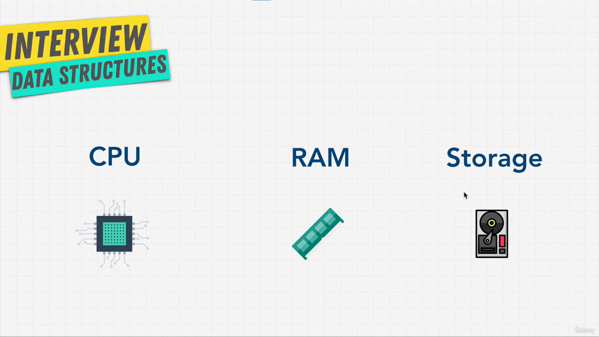
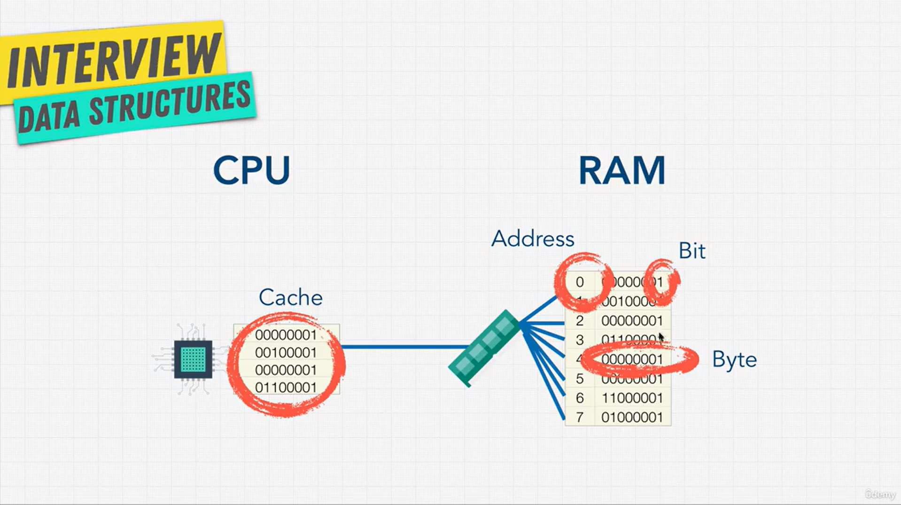
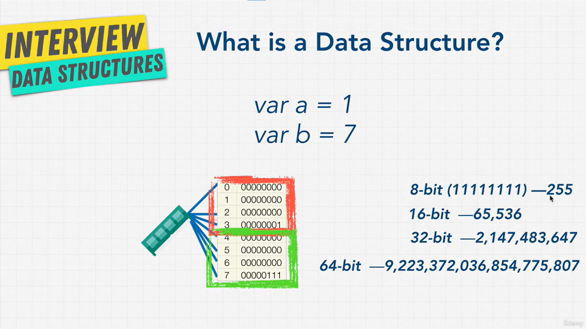

# How Computers Store Data

## How Computers Store Data

### The 3 parts of a computer



When you run code, the computer has to remember things: numbers, strings, arrays. Where does it keep them? Inside a computer there are 3 main parts:

- **CPU**: the little worker. It does all the work and all the math.
- **RAM**: where variables are kept **while a program is running**. It is **fast**, but everything in it is **lost when you turn the computer off**.
- **Storage** (hard disk, SSD, flash drive): where files like videos, music and apps are kept. It is **permanent**: your files are still there when you turn the computer back on. But it is **slow**.

So why not keep everything in storage, so we never lose anything? Because storage is slow. The CPU can get data from RAM **much faster** than from storage.

**Example: Google Chrome**

1. Chrome is saved in **storage**, so it's still there tomorrow.
2. When you open Chrome, the CPU **loads it from storage into RAM**.
3. While Chrome runs, its variables (like `var a = 1`) live in **RAM**, so it runs fast.
4. When you close Chrome, the RAM is cleared. Next time, the CPU loads it from storage again.

### Inside RAM: shelves, bits and bytes



Think of RAM as a **giant set of shelves**. Every shelf has a **number** on it. That number is called an **address** (0, 1, 2, 3 ...).

Each shelf holds **8 tiny switches**. Each switch can be **off (`0`)** or **on (`1`)**. One switch is called a **bit**. 8 bits together are called a **byte**. So **each shelf holds 1 byte**.

The CPU talks to the RAM through a **memory controller**. The memory controller has a **direct wire to every shelf**. So when the CPU asks "What's on shelf 0?" and then "What's on shelf 10,781?", it gets the answer right away. It doesn't have to walk past all the shelves in between. That's why it's called **Random Access** Memory: you can jump to **any** shelf, as long as you know its number.

But there's one more trick. Even though the CPU can jump anywhere, reading shelves that are **close together** is **faster**. Reading shelf 0 and then shelf 1 is faster than reading shelf 0 and then shelf 1,000. Computers are built to get a speed boost for nearby shelves.

To be even faster, the CPU has its own **tiny memory** right next to it, called a **cache**. It keeps a copy of the things it used **most recently**, so it doesn't have to go to RAM again. (You may hear about an **LRU cache**: it keeps the most recent things and throws out the oldest.)

### How a variable is stored



Now let's store a variable:

```js
var a = 1;
var b = 7;
```

A number usually takes **32 bits**. That's 4 bytes, so it uses **4 shelves**.

- `a = 1` goes on shelves **0, 1, 2, 3** (`00000000 00000000 00000000 00000001`)
- `b = 7` goes on the next shelves, **4, 5, 6, 7** (`00000000 00000000 00000000 00000111`)

The more bits you have, the bigger the number you can store:

| Bits   | Biggest number            |
| ------ | ------------------------- |
| 8-bit  | 255                       |
| 16-bit | 65,535                    |
| 32-bit | 2,147,483,647             |
| 64-bit | 9,223,372,036,854,775,807 |

So an 8-bit system **can't** store 256. It's too big to fit.

### When a number is too big

When a number is too big to fit, it's called **integer overflow**. You can see this in JavaScript (which stores numbers in 64 bits):

```js
Math.pow(5, 100); // 7.888609052210118e+69  (5 to the power of 100)
Math.pow(6, 100); // 6.533186235000709e+77
Math.pow(6, 1000); // Infinity
```

`6` to the power of `1000` is too big to fit in memory. So JavaScript just says `Infinity`.

It's not only numbers. **Every type of data** (strings, true/false ...) takes a set number of bits, and the computer has to find shelves in RAM for it.

### So what is a data structure?

Now it all comes together. A data structure is **a way to arrange data on these shelves in RAM**.

- Some data structures keep items **right next to each other** on the shelves.
- Others keep items **spread apart**.
- Each way has **good and bad sides** for reading and writing data.

Our goal is simple: **make the CPU do as little work as possible** to read and write data. That's why data structures are so powerful. When you pick a data structure, you're really choosing how your data sits in the computer's memory.

> **Key idea:** A data structure decides where data sits in RAM. Good placement means less work for the CPU, and less work means faster code.

## Data Structures In Different Languages

- Learn a small set of data structures, and **when and why** to use each one. They cover about 90% of cases.

**2 kinds of data types (JavaScript / TypeScript):**

- Each language has its own **data types**. JavaScript has numbers, strings, booleans (`true`/`false`), `undefined`...
- Each language also has **data structures** to organize them. JavaScript has **arrays** and **objects** (e.g. an array full of objects).

| Kind                                 | What it is                                       | Examples                                                |
| ------------------------------------ | ------------------------------------------------ | ------------------------------------------------------- |
| **Primitive** (simple)               | One single value                                 | numbers, strings, booleans (`true`/`false`), `undefined` |
| **Complex** (data structures)        | Holds and organizes many values                  | **arrays**, **objects**                                 |

```js
// Primitive
let age = 25;
let name = "Sam";
let isOnline = true;

// Complex: an array that holds objects
let users = [
  { name: "Sam", age: 25 },
  { name: "Mia", age: 30 },
];
```

```ts
// TypeScript: same data, but you write the type
let age: number = 25;
let name: string = "Sam";
let isOnline: boolean = true;

let users: { name: string; age: number }[] = [
  { name: "Sam", age: 25 },
  { name: "Mia", age: 30 },
];
```

**Built-in data structures by language:**

| Data structure         | JavaScript / TypeScript              | Java                                                           | Python                        | C++                          | C#                                                        |
| ---------------------- | ------------------------------------ | -------------------------------------------------------------- | ----------------------------- | ---------------------------- | --------------------------------------------------------- |
| **Arrays**             | Built in                             | Built in                                                       | Built in                      | Built in                     | Built in                                                  |
| **Dynamic Arrays**     | Array (`[]`, grows by itself)        | ArrayList                                                      | list                          | std::vector                  | ArrayList                                                 |
| **Linked List**        | N/A (build your own)                 | LinkedList                                                     | N/A (list is a dynamic array) | std::list                    | LinkedList                                                |
| **Stacks**             | N/A (use Array `push` / `pop`)       | Stack                                                          | N/A (use list as a stack)     | std::stack                   | Stack                                                     |
| **Queues**             | N/A (use Array `push` / `shift`)     | LinkedList                                                     | queue, deque, or list         | std::queue                   | Queue                                                     |
| **Priority Queues**    | N/A (build your own)                 | PriorityQueue                                                  | PriorityQueue, or heapq       | std::priority_queue          | N/A                                                       |
| **Deque**              | N/A (use Array)                      | LinkedList                                                     | deque                         | std::deque                   | N/A                                                       |
| **Associative Arrays** | Object (`{}`), Map                   | Hash Table / ConcurrentHashMap, LinkedHashMap, HashMap, TreeMap | dict                          | std::map, std::unordered_map | Dictionary, Hashtable, StringDictionary, SortedDictionary |
| **Sets**               | Set                                  | HashSet, TreeSet                                               | set, frozenset                | std::set, std::unordered_set | HashSet, SortedSet                                        |
| **Graphs**             | N/A                                  | N/A                                                            | N/A                           | N/A                          | N/A                                                       |

- **Language missing one?** Build it yourself. e.g. JavaScript has no stack, but you can build one with what it has.

> **Key idea:** Every language gives you some data structures. If one is missing, you can build it.

## Operations On Data Structures

**6 things you can do with data:**

| Operation     | Meaning                                         | Example                          |
| ------------- | ----------------------------------------------- | -------------------------------- |
| **Insertion** | Add a new item                                  | Add "apple" to the list          |
| **Deletion**  | Remove an item                                  | Remove "mango" from the list     |
| **Traversal** | Visit every item **once** to work with it       | Print every item                 |
| **Searching** | Find where an item is (if it exists)            | Is "apple" in the list? Where?   |
| **Sorting**   | Put items in order                              | 1, 2, 3 or A, B, C               |
| **Access**    | Get an item (the most important one)            | Get the 3rd item                 |

- Each data structure is **good at some** operations and **bad at others**.
- The [Big O Cheat Sheet](../001-Big-O/Cheat-Sheet.md) shows the Big O of **access, search, insertion, deletion** for each data structure (average and worst case).
- For each data structure in this course, we'll learn these pros and cons, so you can pick the right one.

> **Key idea:** Pick a data structure by asking: which operations do I need most, and how fast is each one?
